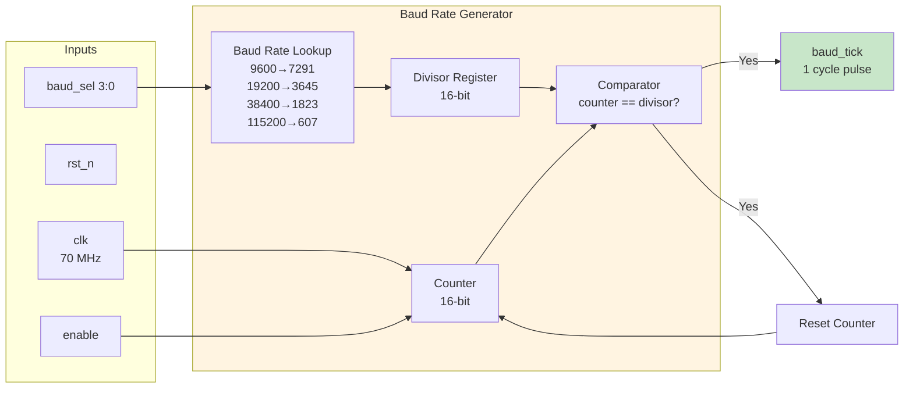
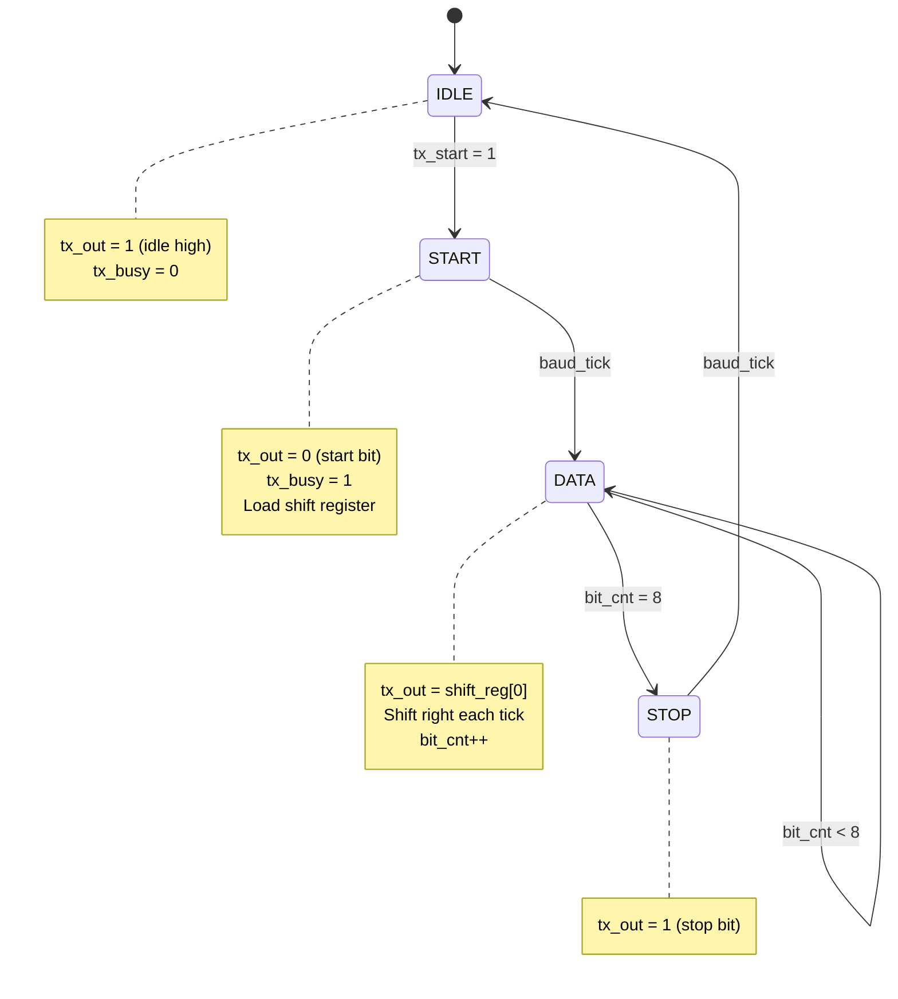
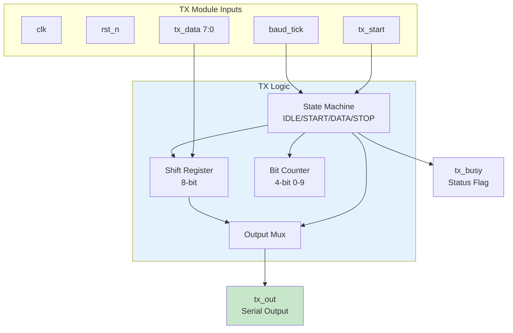
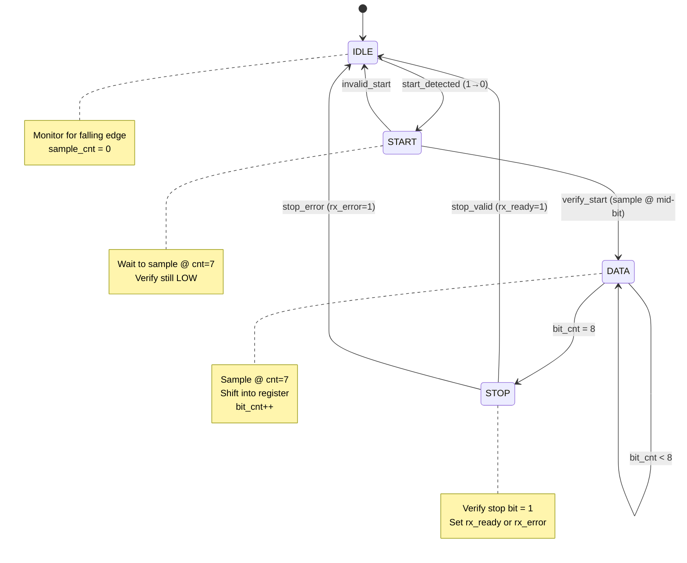
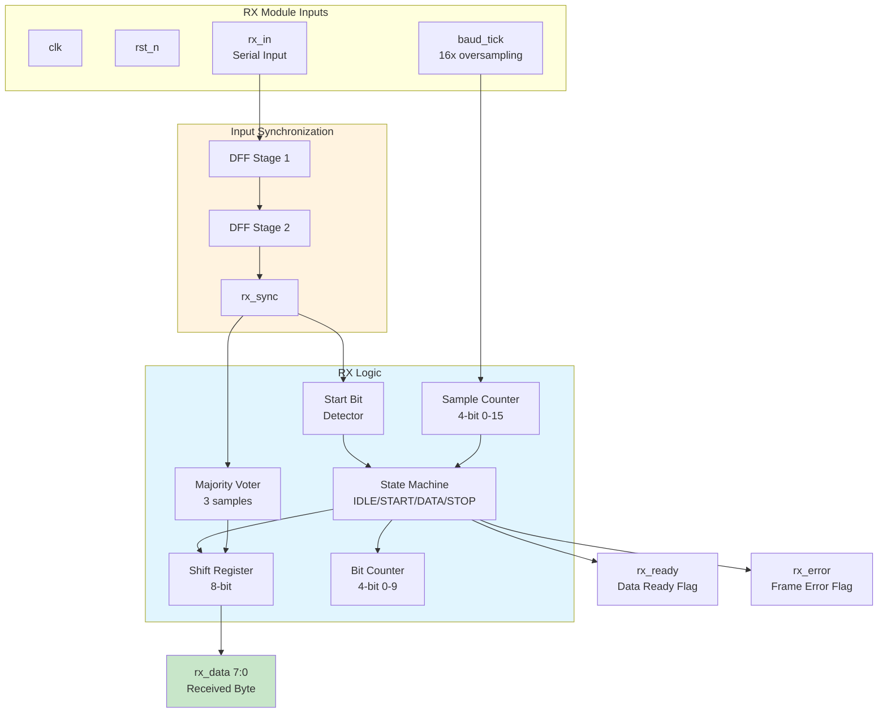
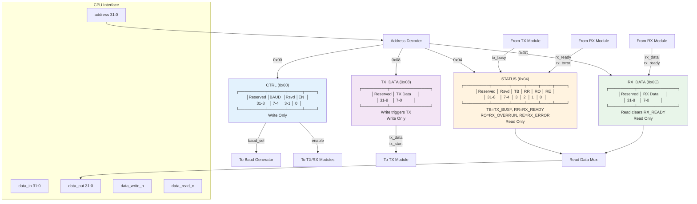
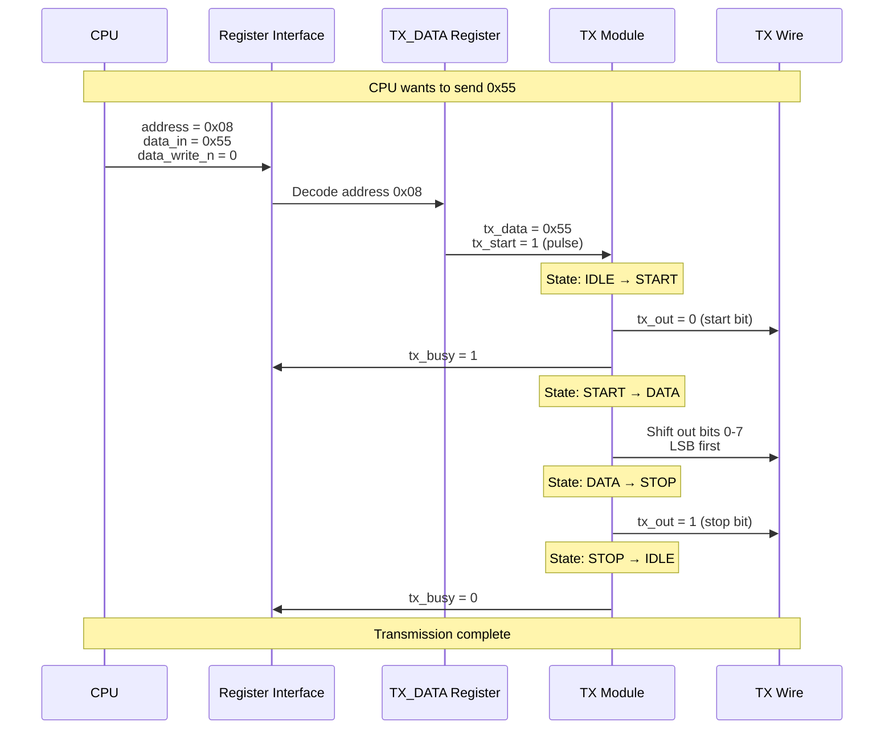
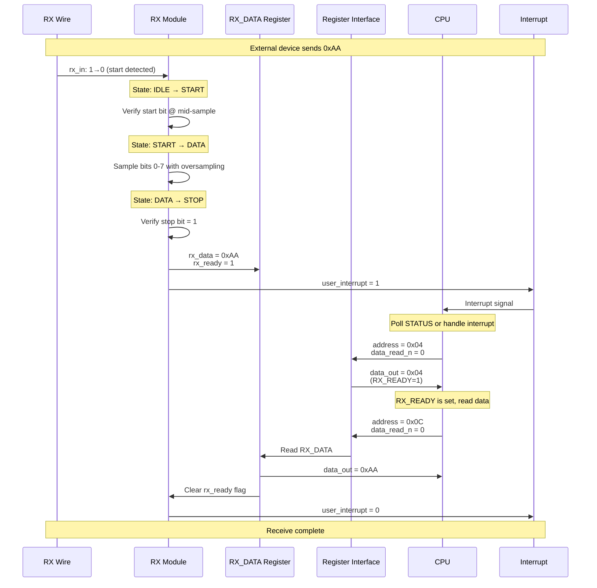

# UART Peripheral Block Diagrams

This document serves as the index for all UART peripheral diagrams, organized by format for easy navigation and better viewing experience.

---

## 📁 Diagram Organization

All diagrams have been organized into the [diagrams/](diagrams/) folder, separated by format to avoid rendering conflicts and provide the best viewing experience for each type.

### Available Diagram Formats

1. **[Mermaid Diagrams](diagrams/mermaid_diagrams.md)** 📊
   - Interactive, zoomable diagrams  
   - Best viewed in: GitHub, VS Code (with Mermaid extension), GitLab
   - Includes: Architecture, state machines, sequence diagrams, block diagrams

2. **[ASCII Art Diagrams](diagrams/ascii_diagrams.md)** 📝
   - Text-based, works in any editor
   - Best for: Quick reference, offline viewing, printing
   - Includes: All major modules with detailed annotations

3. **[Timing Diagrams](diagrams/timing_diagrams.md)** ⏱️
   - Waveform representations
   - Best for: Understanding signal timing, debugging protocol issues
   - Includes: Complete transaction timing, baud rate generation, oversampling

4. **[Diagrams README](diagrams/README.md)** 📖
   - Quick reference guide
   - Usage tips and design decisions summary

---

## 🎯 Quick Navigation by Topic

| I want to understand... | Go to | File |
|-------------------------|-------|------|
| **Overall system architecture** | System overview showing CPU ↔ UART ↔ External | [Mermaid #1](diagrams/mermaid_diagrams.md#1-top-level-system-architecture) or [ASCII #1](diagrams/ascii_diagrams.md#1-top-level-system-architecture) |
| **How baud rate is generated** | Baud rate generator with counter logic | [Mermaid #2](diagrams/mermaid_diagrams.md#2-baud-rate-generator-module) or [ASCII #2](diagrams/ascii_diagrams.md#2-baud-rate-generator-module) |
| **TX state machine flow** | Transmitter state diagram (IDLE→START→DATA→STOP) | [Mermaid #3](diagrams/mermaid_diagrams.md#3-uart-transmitter---state-machine) or [ASCII #3](diagrams/ascii_diagrams.md#3-uart-transmitter-tx-module) |
| **TX internal logic** | Transmitter block diagram with shift register | [Mermaid #4](diagrams/mermaid_diagrams.md#4-uart-transmitter---block-diagram) or [ASCII #3](diagrams/ascii_diagrams.md#3-uart-transmitter-tx-module) |
| **RX state machine flow** | Receiver state diagram with oversampling | [Mermaid #5](diagrams/mermaid_diagrams.md#5-uart-receiver---state-machine) or [ASCII #4](diagrams/ascii_diagrams.md#4-uart-receiver-rx-module) |
| **RX internal logic** | Receiver block diagram with synchronizer | [Mermaid #6](diagrams/mermaid_diagrams.md#6-uart-receiver---block-diagram) or [ASCII #4](diagrams/ascii_diagrams.md#4-uart-receiver-rx-module) |
| **Register addresses & bit fields** | Complete memory map with all registers | [Mermaid #7](diagrams/mermaid_diagrams.md#7-register-interface---memory-map) or [ASCII #5](diagrams/ascii_diagrams.md#5-register-interface--memory-map) |
| **CPU write transaction flow** | Sequence diagram for sending data | [Mermaid #8](diagrams/mermaid_diagrams.md#8-transaction-sequence---write-send-data) or [Timing #4](diagrams/timing_diagrams.md#4-cpu-write-transaction-timing-send-byte) |
| **CPU read transaction flow** | Sequence diagram for receiving data | [Mermaid #9](diagrams/mermaid_diagrams.md#9-transaction-sequence---read-receive-data) or [Timing #5](diagrams/timing_diagrams.md#5-cpu-read-transaction-timing-receive-byte) |
| **Module hierarchy** | Tree showing all submodules | [Mermaid #10](diagrams/mermaid_diagrams.md#10-module-hierarchy) or [ASCII #6](diagrams/ascii_diagrams.md#6-module-hierarchy) |
| **Signal timing & waveforms** | Complete timing diagrams | [Timing Diagrams](diagrams/timing_diagrams.md) |
| **Frame format (8N1)** | Bit-by-bit transmission timing | [Timing #1](diagrams/timing_diagrams.md#1-complete-uart-transaction-timing) |
| **Oversampling details** | 16x oversampling with majority voting | [Timing #7](diagrams/timing_diagrams.md#7-rx-oversampling-detail-zoomed-into-1-bit-period) |

---

## 🚀 Recommended Learning Path

For first-time learners, we recommend viewing diagrams in this order:

1. **Start Here**: [Top-Level System Architecture](diagrams/mermaid_diagrams.md#1-top-level-system-architecture)
   - Understand how UART peripheral connects to TinyQV CPU
   - See the big picture before diving into details

2. **Baud Rate**: [Baud Rate Generator](diagrams/mermaid_diagrams.md#2-baud-rate-generator-module)
   - Learn how clock division creates baud rate timing
   - See lookup table for different speeds

3. **Transmitter**: [TX State Machine](diagrams/mermaid_diagrams.md#3-uart-transmitter---state-machine) → [TX Block Diagram](diagrams/mermaid_diagrams.md#4-uart-transmitter---block-diagram)
   - Understand the TX flow: IDLE → START → DATA → STOP
   - See how shift register serializes data

4. **Receiver**: [RX State Machine](diagrams/mermaid_diagrams.md#5-uart-receiver---state-machine) → [RX Block Diagram](diagrams/mermaid_diagrams.md#6-uart-receiver---block-diagram)  
   - Understand RX with oversampling
   - See synchronizer and majority voting

5. **Registers**: [Register Interface Memory Map](diagrams/mermaid_diagrams.md#7-register-interface---memory-map)
   - Learn the register addresses (0x00, 0x04, 0x08, 0x0C)
   - Understand bit fields in each register

6. **Transactions**: [Write Sequence](diagrams/mermaid_diagrams.md#8-transaction-sequence---write-send-data) → [Read Sequence](diagrams/mermaid_diagrams.md#9-transaction-sequence---read-receive-data)
   - See how CPU sends and receives bytes
   - Understand polling vs interrupts

7. **Timing**: [Complete Transaction Timing](diagrams/timing_diagrams.md#1-complete-uart-transaction-timing)
   - See actual waveforms for sending/receiving
   - Understand bit timing at different baud rates

---

## 📋 Design Summary

### Key Parameters

| Parameter | Value | Notes |
|-----------|-------|-------|
| **System Clock** | 70 MHz | TinyQV core frequency |
| **Baud Rates** | 9600, 19200, 38400, 115200 | Configurable via register |
| **Frame Format** | 8N1 | 8 data bits, no parity, 1 stop bit (fixed) |
| **Oversampling** | 16x | For RX only (better noise immunity) |
| **TX FIFO** | None | Direct transmission (future enhancement) |
| **RX FIFO** | None | Direct receive (future enhancement) |
| **Flow Control** | None | Simple design |
| **Interrupts** | user_interrupt | RX data ready signal |

### Register Map

| Address | Register | Access | Description |
|---------|----------|--------|-------------|
| 0x00 | CTRL | Write | Control: baud rate select [7:4], enable [0] |
| 0x04 | STATUS | Read | Status: TX_BUSY [3], RX_READY [2], RX_OVERRUN [1], RX_ERROR [0] |
| 0x08 | TX_DATA | Write | Transmit data [7:0], writing triggers TX |
| 0x0C | RX_DATA | Read | Receive data [7:0], reading clears RX_READY |

### Pin Connections

| Signal | Direction | Description |
|--------|-----------|-------------|
| ui_in[7] | Input | UART RX (serial input from external device) |
| uo_out[0] | Output | UART TX (serial output to external device) |
| user_interrupt | Output | Interrupt signal (RX data ready) |

---

## 🎨 Viewing Tips

### For Mermaid Diagrams

- **GitHub**: Diagrams render automatically (just click the link!)
- **VS Code**: Install "Markdown Preview Mermaid Support" extension
- **Export**: Use [mermaid.live](https://mermaid.live) to export to PNG/SVG

### For ASCII Diagrams

- **Best in**: Monospaced fonts (Courier, Consolas, Monaco)
- **VS Code**: Already perfect!
- **Terminal**: `cat diagrams/ascii_diagrams.md | less`
- **Print**: ASCII diagrams print beautifully on paper

### For Timing Diagrams

- **Zoom In**: Use Ctrl/Cmd + Plus to see waveform details
- **Compare**: Open side-by-side with code for debugging
- **Reference**: Great for verifying GTKWave waveforms

---

## 📚 Related Documentation

- **[UART Fundamentals](UART_FUNDAMENTALS.md)**: Complete beginner's guide with analogies
- **[Project Plan](PROJECT_PLAN.md)**: 9-phase implementation roadmap (Jan 19-28)
- **[Diagrams README](diagrams/README.md)**: Detailed guide for each diagram type

---

## 🔗 External Resources

- **Mermaid Documentation**: https://mermaid.js.org/
- **UART Tutorial**: http://www.ti.com/lit/an/spma038/spma038.pdf
- **Serial Communication**: https://learn.sparkfun.com/tutorials/serial-communication

---

**Happy Learning!** 🎓

Use these diagrams alongside the fundamentals and project plan to build your understanding and guide your implementation.
    
    subgraph UART["UART Peripheral"]
        REG[Register Interface]
        CTRL[Control Register]
        STATUS[Status Register]
        TXDATA[TX Data Register]
        RXDATA[RX Data Register]
        BAUD[Baud Rate Generator]
        TX[TX Module]
        RX[RX Module]
        
        REG --> CTRL
        REG --> STATUS
        REG --> TXDATA
        REG --> RXDATA
        CTRL --> BAUD
        CTRL --> TX
        CTRL --> RX
        BAUD --> TX
        BAUD --> RX
        TX --> STATUS
        RX --> STATUS
        TXDATA --> TX
        RX --> RXDATA
    end
    
    BUS -->|address[31:0]| REG
    BUS -->|data_in[31:0]| REG
    REG -->|data_out[31:0]| BUS
    BUS -->|data_write_n| REG
    BUS -->|data_read_n| REG
    
    TX -->|uo_out[0]| EXT[External Device]
    EXT -->|ui_in[7]| RX
    RX -->|user_interrupt| BUS
    
    style TinyQV fill:#e1f5ff
    style UART fill:#fff4e1
    style EXT fill:#e8f5e9
```

### ASCII Art Diagram

```
┌─────────────────────────────────────────────────────────────────────┐
│                         TinyQV RISC-V Core                          │
│                                                                     │
│  ┌──────────────┐    32-bit Bus Interface                         │
│  │    CPU       │                                                  │
│  │   Pipeline   │───┐                                              │
│  └──────────────┘   │                                              │
│                     │                                              │
│  ┌──────────────┐   │                                              │
│  │   Memory     │   │                                              │
│  │  Controller  │◄──┤                                              │
│  └──────────────┘   │                                              │
│                     │                                              │
└─────────────────────┼──────────────────────────────────────────────┘
                      │
                      │ address[31:0]
                      │ data_in[31:0]
                      │ data_out[31:0]
                      │ data_write_n
                      │ data_read_n
                      ▼
┌─────────────────────────────────────────────────────────────────────┐
│                   UART Peripheral (peripheral.v)                    │
│                                                                     │
│  ┌───────────────────────────────────────────────────────────────┐ │
│  │              Register Interface / Decoder                     │ │
│  │   - Address decode (0x00, 0x04, 0x08, 0x0C)                  │ │
│  │   - Read/Write control                                       │ │
│  │   - Register banking                                         │ │
│  └────────┬────────────────┬────────────────┬────────────────────┘ │
│           │                │                │                      │
│           ▼                ▼                ▼                      │
│  ┌────────────┐   ┌────────────┐   ┌────────────┐   ┌──────────┐ │
│  │   CTRL     │   │  STATUS    │   │  TX_DATA   │   │ RX_DATA  │ │
│  │  Register  │   │  Register  │   │  Register  │   │ Register │ │
│  │            │   │            │   │            │   │          │ │
│  │ [Baud Sel] │   │ [TX Busy]  │   │ [8 bits]   │   │[8 bits]  │ │
│  │ [Enable]   │   │ [RX Ready] │   │            │   │          │ │
│  └─────┬──────┘   └──────▲─────┘   └─────┬──────┘   └────▲─────┘ │
│        │                 │                │               │       │
│        │ baud_sel        │ status         │ tx_data       │ rx_data
│        │ enable          │                │               │       │
│        │                 │                ▼               │       │
│        │         ┌───────┴──────┐   ┌─────────────┐      │       │
│        │         │              │   │             │      │       │
│        ├────────►│ Baud Rate    │◄──┤  TX Module  │      │       │
│        │         │  Generator   │   │             │      │       │
│        │         │              │   └──────┬──────┘      │       │
│        │         │  - Counter   │          │ tx_out      │       │
│        │         │  - Divider   │          │             │       │
│        │         │              │          │             │       │
│        │         └───────┬──────┘          │             │       │
│        │                 │                 │             │       │
│        │                 │ baud_tick       │             │       │
│        │                 │                 │             │       │
│        │                 ▼                 │             │       │
│        │         ┌──────────────┐          │             │       │
│        └────────►│  RX Module   │          │             │       │
│                  │              │          │             │       │
│                  └───────▲──────┘          │             │       │
│                          │                 │             │       │
│                          │ rx_in           │             │       │
│                          │                 │             │       │
└──────────────────────────┼─────────────────┼─────────────┼───────┘
                           │                 │             │
                    ┌──────┴─────┐    ┌──────┴─────┐      │
                    │  ui_in[7]  │    │ uo_out[0]  │      │
                    │    (RX)    │    │    (TX)    │      │
                    └────────────┘    └────────────┘      │
                                                           │
                                                    ┌──────┴──────┐
                                                    │user_interrupt│
                                                    │ (RX Ready)  │
                                                    └─────────────┘
```

---

## 2. Baud Rate Generator Module

### Mermaid Diagram



### ASCII Art Diagram

```
┌─────────────────────────────────────────────────────────────┐
│               Baud Rate Generator Module                     │
│                                                              │
│  Inputs:                                                     │
│    - clk           : System clock (70 MHz)                  │
│    - rst_n         : Async active-low reset                 │
│    - baud_sel[3:0] : Baud rate selection                    │
│    - enable        : Enable baud generator                  │
│                                                              │
│  Outputs:                                                    │
│    - baud_tick     : Baud rate clock pulse (1 cycle pulse)  │
│                                                              │
│  ┌────────────────────────────────────────────────────────┐ │
│  │                 Baud Rate Lookup                       │ │
│  │                                                        │ │
│  │  baud_sel │ Baud Rate │ Divisor (70MHz)               │ │
│  │  ─────────┼───────────┼───────────────                │ │
│  │    0000   │   9600    │    7291                       │ │
│  │    0001   │  19200    │    3645                       │ │
│  │    0010   │  38400    │    1823                       │ │
│  │    0011   │ 115200    │     607                       │ │
│  │    ...    │   ...     │    ...                        │ │
│  └────────────────────────────────────────────────────────┘ │
│                          │                                   │
│                          ▼                                   │
│  ┌────────────────────────────────────────────────────────┐ │
│  │              Divisor Register                          │ │
│  │                 divisor[15:0]                          │ │
│  └────────────────────────┬───────────────────────────────┘ │
│                           │                                  │
│                           ▼                                  │
│  ┌────────────────────────────────────────────────────────┐ │
│  │              Counter Logic                             │ │
│  │                                                        │ │
│  │   counter[15:0] ────┐                                 │ │
│  │                     │                                 │ │
│  │              ┌──────▼──────┐                          │ │
│  │              │  counter++  │                          │ │
│  │              └──────┬──────┘                          │ │
│  │                     │                                 │ │
│  │              ┌──────▼──────┐                          │ │
│  │              │ == divisor? │─── Yes ──► baud_tick=1  │ │
│  │              └──────┬──────┘                          │ │
│  │                     │                                 │ │
│  │                     No                                │ │
│  │                     │                                 │ │
│  │                     ▼                                 │ │
│  │              baud_tick=0                              │ │
│  └────────────────────────────────────────────────────────┘ │
└──────────────────────────────────────────────────────────────┘

Example:
  For 9600 baud at 70 MHz:
    - Divisor = 70,000,000 / 9600 = 7291.67 ≈ 7291
    - Counter counts 0→7290, then resets
    - baud_tick pulses once per bit period
```

---

## 3. UART Transmitter (TX) Module

### Mermaid State Machine Diagram



### Mermaid Block Diagram



### ASCII Art Diagram

```
┌─────────────────────────────────────────────────────────────────┐
│                    UART TX Module                                │
│                                                                  │
│  Inputs:                                                         │
│    - clk        : System clock                                  │
│    - rst_n      : Reset                                         │
│    - baud_tick  : Baud rate tick from generator                │
│    - tx_data[7:0] : Data byte to transmit                      │
│    - tx_start   : Start transmission pulse                      │
│                                                                  │
│  Outputs:                                                        │
│    - tx_out     : Serial output (to uo_out[0])                 │
│    - tx_busy    : Transmission in progress flag                │
│                                                                  │
│  ┌────────────────────────────────────────────────────────────┐ │
│  │                   TX State Machine                         │ │
│  │                                                            │ │
│  │        ┌─────────┐                                         │ │
│  │        │  IDLE   │◄────────────────┐                      │ │
│  │        └────┬────┘                  │                      │ │
│  │             │ tx_start              │ bit_cnt==10         │ │
│  │             │                       │                      │ │
│  │        ┌────▼────┐                  │                      │ │
│  │        │  START  │                  │                      │ │
│  │        └────┬────┘                  │                      │ │
│  │             │ baud_tick             │                      │ │
│  │             │                       │                      │ │
│  │        ┌────▼────┐                  │                      │ │
│  │        │  DATA   │──────────────────┘                      │ │
│  │        │(8 bits) │                                         │ │
│  │        └────┬────┘                                         │ │
│  │             │ bit_cnt==8                                   │ │
│  │             │                                              │ │
│  │        ┌────▼────┐                                         │ │
│  │        │  STOP   │                                         │ │
│  │        └─────────┘                                         │ │
│  └────────────────────────────────────────────────────────────┘ │
│                                                                  │
│  ┌────────────────────────────────────────────────────────────┐ │
│  │                   Shift Register                           │ │
│  │                                                            │ │
│  │   ┌───┬───┬───┬───┬───┬───┬───┬───┐                      │ │
│  │   │ 7 │ 6 │ 5 │ 4 │ 3 │ 2 │ 1 │ 0 │ ◄── tx_data          │ │
│  │   └─┬─┴─┬─┴─┬─┴─┬─┴─┬─┴─┬─┴─┬─┴─┬─┘                      │ │
│  │     │   │   │   │   │   │   │   │                        │ │
│  │     └───┴───┴───┴───┴───┴───┴───┴──► Shift right         │ │
│  │                                       (LSB first)          │ │
│  │                                          │                 │ │
│  │                                          ▼                 │ │
│  │                                       tx_out               │ │
│  └────────────────────────────────────────────────────────────┘ │
│                                                                  │
│  ┌────────────────────────────────────────────────────────────┐ │
│  │                  Bit Counter                               │ │
│  │                                                            │ │
│  │   bit_cnt[3:0] : Counts 0→9                               │ │
│  │     0     : Start bit                                     │ │
│  │     1-8   : Data bits (LSB first)                         │ │
│  │     9     : Stop bit                                      │ │
│  └────────────────────────────────────────────────────────────┘ │
│                                                                  │
│  TX Frame Format (8N1):                                         │
│                                                                  │
│   Idle  Start   D0   D1   D2   D3   D4   D5   D6   D7   Stop   │
│    ──┐  ┌───┬───┬───┬───┬───┬───┬───┬───┬───┬───┬───┬───┐     │
│      │  │   │   │   │   │   │   │   │   │   │   │   │   │──   │
│      └──┘   └───┴───┴───┴───┴───┴───┴───┴───┴───┴───┴───┘     │
│                                                                  │
│   Logic Levels: Idle=1, Start=0, Data=varies, Stop=1           │
└──────────────────────────────────────────────────────────────────┘
```

---

## 4. UART Receiver (RX) Module

### Mermaid State Machine Diagram



### Mermaid Block Diagram



### ASCII Art Diagram

```
┌─────────────────────────────────────────────────────────────────┐
│                    UART RX Module                                │
│                                                                  │
│  Inputs:                                                         │
│    - clk        : System clock                                  │
│    - rst_n      : Reset                                         │
│    - baud_tick  : Baud rate tick (16x oversampling)            │
│    - rx_in      : Serial input (from ui_in[7])                 │
│                                                                  │
│  Outputs:                                                        │
│    - rx_data[7:0] : Received data byte                         │
│    - rx_ready   : Data ready flag                              │
│    - rx_error   : Frame error flag                             │
│                                                                  │
│  ┌────────────────────────────────────────────────────────────┐ │
│  │              Input Synchronizer                            │ │
│  │              (Metastability Prevention)                    │ │
│  │                                                            │ │
│  │   rx_in ──► [DFF] ──► [DFF] ──► rx_sync                   │ │
│  └────────────────────────────────────────────────────────────┘ │
│                              │                                   │
│                              ▼                                   │
│  ┌────────────────────────────────────────────────────────────┐ │
│  │              Start Bit Detector                            │ │
│  │                                                            │ │
│  │   Detect falling edge: rx_sync = 1→0                      │ │
│  └────────────────────────┬───────────────────────────────────┘ │
│                           │                                      │
│                           ▼                                      │
│  ┌────────────────────────────────────────────────────────────┐ │
│  │            16x Oversampling Counter                        │ │
│  │                                                            │ │
│  │   sample_cnt[3:0] : Counts 0→15 per bit period            │ │
│  │                                                            │ │
│  │   Sample Point: sample_cnt == 7 (middle of bit)           │ │
│  │                                                            │ │
│  │    Bit Period:                                             │ │
│  │    0   1   2   3   4   5   6   7   8   9  10  11 12 13 14 15│ │
│  │    ├───┼───┼───┼───┼───┼───┼───┼───┼───┼───┼───┼───┼───┼───┤│ │
│  │                                  ▲                          │ │
│  │                             Sample Here                     │ │
│  └────────────────────────────────────────────────────────────┘ │
│                                                                  │
│  ┌────────────────────────────────────────────────────────────┐ │
│  │                   RX State Machine                         │ │
│  │                                                            │ │
│  │        ┌─────────┐                                         │ │
│  │        │  IDLE   │◄────────────────┐                      │ │
│  │        └────┬────┘                  │                      │ │
│  │             │ start_detected        │ bit_cnt==9          │ │
│  │             │                       │                      │ │
│  │        ┌────▼────┐                  │                      │ │
│  │        │  START  │                  │                      │ │
│  │        └────┬────┘                  │                      │ │
│  │             │ verify_start          │                      │ │
│  │             │                       │                      │ │
│  │        ┌────▼────┐                  │                      │ │
│  │        │  DATA   │──────────────────┘                      │ │
│  │        │(8 bits) │                                         │ │
│  │        └────┬────┘                                         │ │
│  │             │ bit_cnt==8                                   │ │
│  │             │                                              │ │
│  │        ┌────▼────┐                                         │ │
│  │        │  STOP   │                                         │ │
│  │        └────┬────┘                                         │ │
│  │             │                                              │ │
│  │             ├─ stop_valid ──► rx_ready=1                  │ │
│  │             └─ stop_error ──► rx_error=1                  │ │
│  └────────────────────────────────────────────────────────────┘ │
│                                                                  │
│  ┌────────────────────────────────────────────────────────────┐ │
│  │                   Shift Register                           │ │
│  │                                                            │ │
│  │   ┌───┬───┬───┬───┬───┬───┬───┬───┐                      │ │
│  │   │ 7 │ 6 │ 5 │ 4 │ 3 │ 2 │ 1 │ 0 │                      │ │
│  │   └───┴───┴───┴───┴───┴───┴───┴─▲─┘                      │ │
│  │                                  │                        │ │
│  │   Shift left ◄───────────────────┘ rx_sync (at sample)   │ │
│  │   (LSB first)                                             │ │
│  └────────────────────────────────────────────────────────────┘ │
│                                                                  │
│  ┌────────────────────────────────────────────────────────────┐ │
│  │              Majority Voting (Noise Filter)                │ │
│  │                                                            │ │
│  │   Sample at: cnt=6, cnt=7, cnt=8                          │ │
│  │   Majority wins: 2 out of 3                               │ │
│  │   Example: [0,1,1] → Output = 1                           │ │
│  └────────────────────────────────────────────────────────────┘ │
└──────────────────────────────────────────────────────────────────┘
```

---

## 5. Register Interface Module

### Mermaid Memory Map Diagram



### ASCII Art Diagram

```
┌─────────────────────────────────────────────────────────────────┐
│                  Register Interface Module                       │
│                                                                  │
│  Inputs:                                                         │
│    - clk              : System clock                            │
│    - rst_n            : Reset                                   │
│    - address[31:0]    : Register address from CPU              │
│    - data_in[31:0]    : Write data from CPU                    │
│    - data_write_n     : Write enable (active low)              │
│    - data_read_n      : Read enable (active low)               │
│                                                                  │
│  Outputs:                                                        │
│    - data_out[31:0]   : Read data to CPU                       │
│    - baud_sel[3:0]    : Baud rate select to TX/RX             │
│    - enable           : UART enable to TX/RX                   │
│                                                                  │
│  ┌────────────────────────────────────────────────────────────┐ │
│  │             Address Decoder                                │ │
│  │                                                            │ │
│  │   address[31:0] ──┬──► == 0x00 ? ──► ctrl_sel             │ │
│  │                   ├──► == 0x04 ? ──► status_sel           │ │
│  │                   ├──► == 0x08 ? ──► tx_data_sel          │ │
│  │                   └──► == 0x0C ? ──► rx_data_sel          │ │
│  └────────────────────────────────────────────────────────────┘ │
│                                                                  │
│  ┌────────────────────────────────────────────────────────────┐ │
│  │    Register Map                                            │ │
│  │                                                            │ │
│  │  ┌──────────────────────────────────────────────────────┐ │ │
│  │  │  CTRL (0x00) - Control Register                      │ │ │
│  │  │                                                       │ │ │
│  │  │  31          8  7   4  3     1  0                    │ │ │
│  │  │  ┌────────────┬──────┬────────┬──┐                   │ │ │
│  │  │  │  Reserved  │ BAUD │Reserved│EN│                   │ │ │
│  │  │  └────────────┴──────┴────────┴──┘                   │ │ │
│  │  │                                                       │ │ │
│  │  │  Write Only                                           │ │ │
│  │  │  [7:4] BAUD_SEL: 0=9600, 1=19200, 2=38400, 3=115200 │ │ │
│  │  │  [0]   ENABLE:   1=enabled, 0=disabled               │ │ │
│  │  └───────────────────────────────────────────────────────┘ │ │
│  │                                                            │ │
│  │  ┌──────────────────────────────────────────────────────┐ │ │
│  │  │  STATUS (0x04) - Status Register                     │ │ │
│  │  │                                                       │ │ │
│  │  │  31          8  7   4  3  2  1  0                    │ │ │
│  │  │  ┌────────────┬──────┬──┬──┬──┬──┐                   │ │ │
│  │  │  │  Reserved  │ RES  │TB│RR│RO│RE│                   │ │ │
│  │  │  └────────────┴──────┴──┴──┴──┴──┘                   │ │ │
│  │  │                                                       │ │ │
│  │  │  Read Only                                            │ │ │
│  │  │  [3] TX_BUSY:     1=TX in progress                   │ │ │
│  │  │  [2] RX_READY:    1=RX data available                │ │ │
│  │  │  [1] RX_OVERRUN:  1=RX overrun error                 │ │ │
│  │  │  [0] RX_ERROR:    1=RX frame error                   │ │ │
│  │  └───────────────────────────────────────────────────────┘ │ │
│  │                                                            │ │
│  │  ┌──────────────────────────────────────────────────────┐ │ │
│  │  │  TX_DATA (0x08) - Transmit Data Register             │ │ │
│  │  │                                                       │ │ │
│  │  │  31          8  7           0                         │ │ │
│  │  │  ┌────────────┬──────────────┐                       │ │ │
│  │  │  │  Reserved  │   TX Data    │                       │ │ │
│  │  │  └────────────┴──────────────┘                       │ │ │
│  │  │                                                       │ │ │
│  │  │  Write Only                                           │ │ │
│  │  │  [7:0] Data byte to transmit                         │ │ │
│  │  │  Writing triggers transmission                        │ │ │
│  │  └───────────────────────────────────────────────────────┘ │ │
│  │                                                            │ │
│  │  ┌──────────────────────────────────────────────────────┐ │ │
│  │  │  RX_DATA (0x0C) - Receive Data Register              │ │ │
│  │  │                                                       │ │ │
│  │  │  31          8  7           0                         │ │ │
│  │  │  ┌────────────┬──────────────┐                       │ │ │
│  │  │  │  Reserved  │   RX Data    │                       │ │ │
│  │  │  └────────────┴──────────────┘                       │ │ │
│  │  │                                                       │ │ │
│  │  │  Read Only                                            │ │ │
│  │  │  [7:0] Received data byte                            │ │ │
│  │  │  Reading clears RX_READY flag                        │ │ │
│  │  └───────────────────────────────────────────────────────┘ │ │
│  └────────────────────────────────────────────────────────────┘ │
│                                                                  │
│  ┌────────────────────────────────────────────────────────────┐ │
│  │              Read Data Multiplexer                         │ │
│  │                                                            │ │
│  │   data_out = ctrl_sel    ? ctrl_reg    :                  │ │
│  │              status_sel  ? status_reg  :                  │ │
│  │              tx_data_sel ? 32'h0       :  // Write-only   │ │
│  │              rx_data_sel ? rx_data_reg :                  │ │
│  │              32'h0;                                        │ │
│  └────────────────────────────────────────────────────────────┘ │
└──────────────────────────────────────────────────────────────────┘
```

---

## 6. Complete Signal Flow Diagram

### Mermaid Sequence Diagram - Write Transaction (Send Data)



### Mermaid Sequence Diagram - Read Transaction (Receive Data)



### ASCII Art Diagram

```
CPU Write Transaction Example: Setting Baud Rate to 115200

  Step 1: CPU writes to CTRL register
  ────────────────────────────────────
  
  address      = 32'h0000_0000  (CTRL register)
  data_in      = 32'h0000_0031  (BAUD=3, ENABLE=1)
  data_write_n = 0              (Write enable)
  
        │
        ▼
  ┌─────────────────┐
  │ Address Decoder │
  └────────┬────────┘
           │ ctrl_sel=1
           ▼
  ┌─────────────────┐
  │  CTRL Register  │
  │  BAUD_SEL = 3   │──┐
  │  ENABLE = 1     │  │
  └─────────────────┘  │
                       │
                       ▼
              ┌────────────────┐
              │ Baud Generator │
              │ divisor = 607  │
              └────────┬───────┘
                       │ baud_tick
                       ▼
              ┌────────────────┐
              │   TX Module    │
              │   RX Module    │
              └────────────────┘


CPU Write Transaction Example: Sending Data 0x55

  Step 2: CPU writes to TX_DATA register
  ───────────────────────────────────────
  
  address      = 32'h0000_0008  (TX_DATA register)
  data_in      = 32'h0000_0055  (data = 0x55)
  data_write_n = 0              (Write enable)
  
        │
        ▼
  ┌─────────────────┐
  │ Address Decoder │
  └────────┬────────┘
           │ tx_data_sel=1
           ▼
  ┌─────────────────┐
  │ TX_DATA Register│
  │  data = 0x55    │──┐
  │  tx_start=1     │  │ Pulse
  └─────────────────┘  │
                       ▼
              ┌────────────────┐
              │   TX Module    │
              │  State: IDLE   │
              │    ↓           │
              │  State: START  │
              │    ↓           │
              │  State: DATA   │  TX Line: 0-1-0-1-0-1-0-1-0-1
              │    ↓           │           S D0D1D2D3D4D5D6D7 P
              │  State: STOP   │
              └────────┬───────┘
                       │ tx_busy=0
                       ▼
              ┌────────────────┐
              │ STATUS Register│
              │  TX_BUSY=0     │
              └────────────────┘


CPU Read Transaction Example: Reading Received Data

  Step 3: CPU polls STATUS, then reads RX_DATA
  ─────────────────────────────────────────────
  
  Poll STATUS:
    address     = 32'h0000_0004  (STATUS register)
    data_read_n = 0              (Read enable)
  
        │
        ▼
  ┌─────────────────┐
  │ Address Decoder │
  └────────┬────────┘
           │ status_sel=1
           ▼
  ┌─────────────────┐
  │ STATUS Register │
  │  RX_READY=1     │──► data_out = 32'h0000_0004
  │  TX_BUSY=0      │
  └─────────────────┘
  
  Read RX_DATA (if RX_READY=1):
    address     = 32'h0000_000C  (RX_DATA register)
    data_read_n = 0              (Read enable)
  
        │
        ▼
  ┌─────────────────┐
  │ Address Decoder │
  └────────┬────────┘
           │ rx_data_sel=1
           ▼
  ┌─────────────────┐
  │ RX_DATA Register│
  │  data = 0xAA    │──► data_out = 32'h0000_00AA
  │  rx_ready=0     │    (clear RX_READY flag)
  └─────────────────┘
```

---

## 7. Timing Diagram - Complete UART Transaction

### Mermaid Timing Diagram Representation

```mermaid
gantt
    title UART Transaction Timeline (Sending 0x55, Receiving 0xAA)
    dateFormat X
    axisFormat %L
    
    section TX Operation
    CPU Write 0x55     :milestone, 0, 0
    START bit          :active, 0, 87
    Data bit 0 (1)     :active, 87, 87
    Data bit 1 (0)     :active, 174, 87
    Data bit 2 (1)     :active, 261, 87
    Data bit 3 (0)     :active, 348, 87
    Data bit 4 (1)     :active, 435, 87
    Data bit 5 (0)     :active, 522, 87
    Data bit 6 (1)     :active, 609, 87
    Data bit 7 (0)     :active, 696, 87
    STOP bit           :active, 783, 87
    TX Complete        :milestone, 870, 0
    
    section RX Operation
    START detected     :milestone, 0, 0
    Sample bits 0-7    :active, 87, 696
    STOP verified      :milestone, 783, 0
    RX Interrupt       :crit, 870, 50
    CPU Reads Data     :milestone, 920, 0
```



**Note**: Actual bit durations depend on baud rate. Above shows conceptual timing.
- At 115200 baud: each bit ≈ 8.68 µs
- At 9600 baud: each bit ≈ 104.17 µs

### ASCII Art Diagram

```
Complete Transaction: Send 0x55, Receive 0xAA

Clock (70MHz):
  ╔═╗ ╔═╗ ╔═╗ ╔═╗ ╔═╗ ╔═╗ ╔═╗ ╔═╗ ╔═╗ ╔═╗ ╔═╗ ╔═╗
  ║ ╚═╝ ╚═╝ ╚═╝ ╚═╝ ╚═╝ ╚═╝ ╚═╝ ╚═╝ ╚═╝ ╚═╝ ╚═╝ ╚═

Baud Tick (115200 baud, every 607 clocks):
  ╔═════════════════════════════════════╗       ╔═════════
  ║ (607 cycles)                        ╚═══════╝
  
TX Line (sending 0x55 = 0b01010101):
                 S  D0 D1 D2 D3 D4 D5 D6 D7  P
  Idle ═════════╗  ╔══╗  ╔══╗  ╔══╗  ╔══╗  ╔════════
                ╚══╝  ╚══╝  ╚══╝  ╚══╝  ╚══╝
                |  |  |  |  |  |  |  |  |  |  |
                0  1  0  1  0  1  0  1  0  1  1
                Start  LSB                 MSB Stop

RX Line (receiving 0xAA = 0b10101010):
                 S  D0 D1 D2 D3 D4 D5 D6 D7  P
  Idle ═════════╗  ╔══╗  ╔══╗  ╔══╗  ╔══╗  ╔════════
                ╚══╝  ╚══╝  ╚══╝  ╚══╝  ╚══╝
                |  |  |  |  |  |  |  |  |  |  |
                0  0  1  0  1  0  1  0  1  1  1
                Start  LSB                 MSB Stop

RX_READY Interrupt:
                                                   ╔═══════
  ════════════════════════════════════════════════╝

user_interrupt:
  ════════════════════════════════════════════════╗
                                                   ╚═══════

TX_BUSY:
  ════╗                                      ╔════════════
      ╚══════════════════════════════════════╝

Status Flow:
  1. TX_BUSY=1 when transmission starts
  2. TX sends 10 bits (1 start + 8 data + 1 stop)
  3. TX_BUSY=0 when complete
  4. RX receives 10 bits with 16x oversampling
  5. RX_READY=1, user_interrupt=1 when byte complete
  6. CPU reads RX_DATA, RX_READY=0, interrupt=0
```

---

## 8. Module Hierarchy

### Mermaid Tree Diagram

```mermaid
graph TD
    TOP[tt_um_tqv_peripheral_harness<br/>Top-Level Wrapper]
    
    TOP --> PERIPH[tqvp_uart<br/>UART Peripheral Instance]
    TOP --> HARNESS[test_harness<br/>SPI Interface]
    
    PERIPH --> REGIF[uart_register_interface<br/>Register Decoder & Control]
    PERIPH --> BAUD[uart_baud_generator<br/>Baud Rate Timing]
    PERIPH --> TX[uart_tx<br/>Transmitter]
    PERIPH --> RX[uart_rx<br/>Receiver]
    
    REGIF --> ADDEC[address_decoder]
    REGIF --> CTRLREG[ctrl_register]
    REGIF --> STATREG[status_register]
    REGIF --> TXDREG[tx_data_register]
    REGIF --> RXDREG[rx_data_register]
    
    BAUD --> LUT[divisor_lookup]
    BAUD --> CNT[counter 15:0]
    BAUD --> TICK[tick_generator]
    
    TX --> TXFSM[tx_state_machine<br/>IDLE/START/DATA/STOP]
    TX --> TXSHIFT[shift_register 7:0]
    TX --> TXCNT[bit_counter 3:0]
    TX --> TXDRV[tx_output_driver]
    
    RX --> SYNC[input_synchronizer<br/>2 DFFs]
    RX --> SDET[start_detector]
    RX --> OSCNT[oversample_counter 3:0]
    RX --> RXFSM[rx_state_machine<br/>IDLE/START/DATA/STOP]
    RX --> RXSHIFT[shift_register 7:0]
    RX --> RXCNT[bit_counter 3:0]
    RX --> MAJ[majority_voter]
    RX --> CHECK[frame_checker]
    
    HARNESS --> SPIR[spi_reg]
    HARNESS --> REDET[rising_edge_detector]
    HARNESS --> FEDET[falling_edge_detector]
    HARNESS --> SYNC2[synchronizer]
    HARNESS --> RECLK[reclocking]
    
    style TOP fill:#e1f5ff
    style PERIPH fill:#fff4e1
    style HARNESS fill:#f3e5f5
    style REGIF fill:#e8f5e9
    style BAUD fill:#fff3e0
    style TX fill:#e3f2fd
    style RX fill:#fce4ec
```



### ASCII Art Diagram

```
tt_um_tqv_peripheral_harness (Top)
│
├── tqvp_example (Peripheral Instance)
│   │
│   ├── uart_register_interface
│   │   ├── address_decoder
│   │   ├── ctrl_register
│   │   ├── status_register
│   │   ├── tx_data_register
│   │   └── rx_data_register
│   │
│   ├── uart_baud_generator
│   │   ├── divisor_lookup
│   │   ├── counter [15:0]
│   │   └── tick_generator
│   │
│   ├── uart_tx
│   │   ├── tx_state_machine (IDLE/START/DATA/STOP)
│   │   ├── shift_register [7:0]
│   │   ├── bit_counter [3:0]
│   │   └── tx_output_driver
│   │
│   └── uart_rx
│       ├── input_synchronizer (2 DFFs)
│       ├── start_detector
│       ├── oversample_counter [3:0]
│       ├── rx_state_machine (IDLE/START/DATA/STOP)
│       ├── shift_register [7:0]
│       ├── bit_counter [3:0]
│       ├── majority_voter
│       └── frame_checker
│
└── test_harness (SPI + synchronizers - unchanged)
```

---

## Key Design Decisions

1. **Baud Rate**: Configurable via register (9600-115200 bps)
2. **Frame Format**: Fixed 8N1 (8 data, no parity, 1 stop)
3. **Oversampling**: 16x for RX (better noise immunity)
4. **FIFO**: Optional (can add later if needed)
5. **Flow Control**: None (keep it simple)
6. **Interrupt**: Single interrupt for RX data ready

---

These diagrams provide a complete visual reference for implementing the UART peripheral. Use them alongside the UART fundamentals and project plan to guide your implementation!
